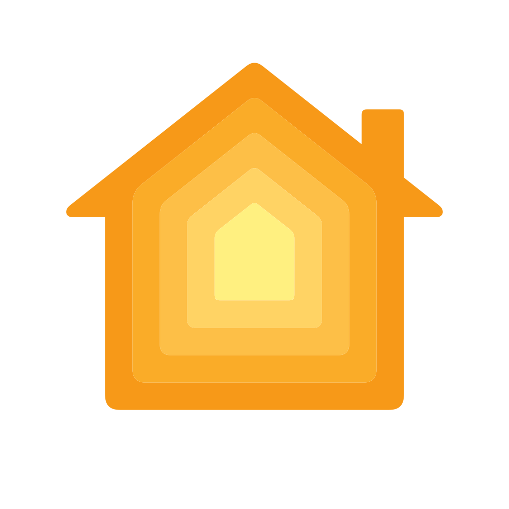

# [Home](https://www.apple.com/de/ios/home/)
Smart Home related projects using  
[HomeKit](https://de.wikipedia.org/wiki/HomeKit) / [Homebridge](https://homebridge.io/) / [Node-RED](https://de.wikipedia.org/wiki/Node-RED) / [MQTT](https://de.wikipedia.org/wiki/MQTT) / [Mongoose OS](https://mongoose-os.com/) / [Electro](https://github.com/griemide/Elektro) / [PCB](https://github.com/griemide/PCB) / [Balkonkraftwerk[(https://github.com/griemide/Balkonkraftwerk)  

Shelly HomeKit Release Notes [2.11.0](https://github.com/mongoose-os-apps/shelly-homekit/releases/tag/2.11.0) released 2022-06-19

<a href="https://www.apple.com/de/ios/home/">
 

## [AF104](AF104/readme.md)
  
## [MPS37](https://github.com/griemide/Shelly/tree/master/Projects)  
  
## [MPS3](https://github.com/griemide/Shelly/tree/master/Projects)
  
## [GS17](https://github.com/griemide/Hardware/blob/master/Funkschalter/readme.md)  
  
  
  
  
  
  
  

